## 经验总结

1、技术更新很快，因此需要锻炼阅读官方文档（中文文档和英文文档）并使用以及独立解决新问题的能力

2、项目做的越多，越会觉得编程语言占的比重不是那么多，除非你专门做性能优化或者底层的东西。开发更多讲的是经验上的东西、你解决问题的能力、思考问题的方式、架构设计的能力等。

3、项目运行出错时，第一要务应该是自己去谷歌、github issues、baidu 等方式解决这个问题，实在不行再去问别人（虽然很多时候问人效率更高，懂得取舍吧，各有各的好处），注意问别人可以试试赏金平台！

## 技术选型

### 前置依赖

1、npm 安装脚手架是一个难点，至少要明白 npm 怎么使用。

### Ant Design Pro

[官方地址](https://pro.ant.design/zh-CN)

本项目使用的是 React 版本，Vue 版本鱼皮不熟练，而且企业中常用的还是 React 版本。

具体命令官网有，鱼皮也是根据官网步骤来的。

#### node 降级

出现版本不一致的情况，询问 gpt "node 降级" 得到了一个 nvm-windows 的 github 地址，下载了这个软件，全称为：node verson manager，通过它可以管理 node 版本

**安装特定版本的 Node.js：**

`nvm install <version>`

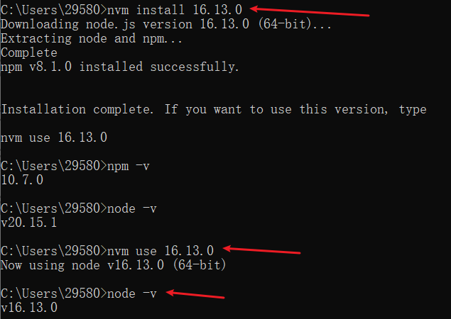

#### npm 降级

您可以使用 `npm install -g` 命令直接安装所需版本的 `npm`。以下是具体步骤：

**降级 npm**：

使用以下命令安装特定版本的 `npm`，将 `<version>` 替换为您想要的版本号。例如，要降级到 `6.14.15`：

`npm install -g npm@<version>`

例如：

`npm install -g npm@6.14.15`

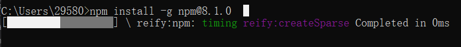

执行了好久，为何没什么变化？

这可用性也太差了吧！没忍住 ctrl+c 终止了，结果 npm 已经被删掉了。

解决办法：

由于下载 node.js 时候 npm 也会下载，因此用 nvm 卸载 node.js 并重新下载即可！

重新下载之后的 npm 就是 8.1.0 版本了！不知道是刚刚已经下载完了还是什么原因。

node.js 16.13.0 对应 npm 8.1.0 吗？

#### 仍存在问题（但成功解决了）

至此，完成了 node、npm 的降级，但是 npm install yarn 仍然存在问题

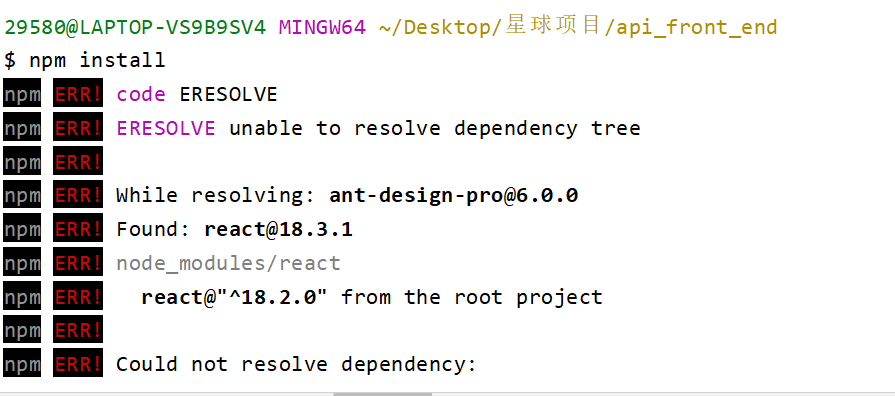

尝试重新执行 `npm i @ant-design/pro-cli -g`（猜测，因为刚刚的 npm 版本不是 8.1.0）

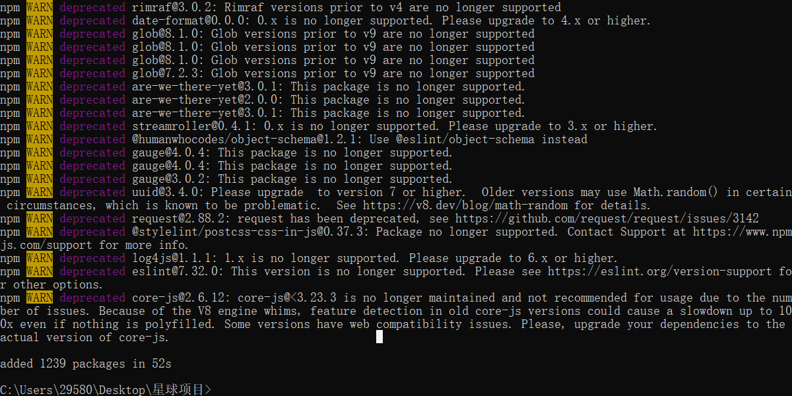

**测试结果：这个方法解决不了**

至少一点：

`pro create project_name` 这个命令执行后，结果和鱼皮的视频中展示的有差异

鱼皮的：

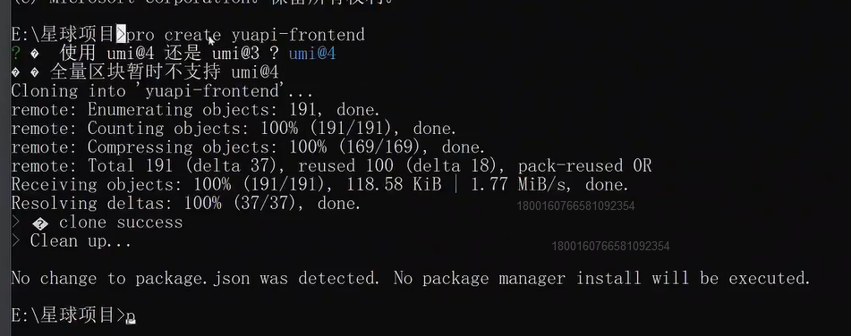

我的：

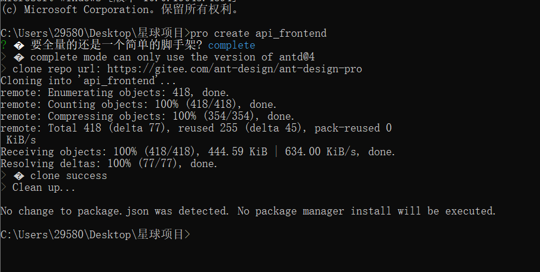

尝试选择这样：

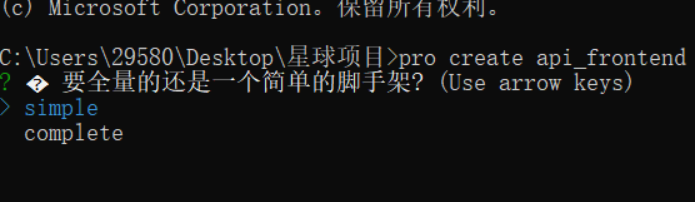

**测试结果：这个方法可以解决！（虽然不明白 node 和 npm 的版本和鱼皮都一致，为什么情况不一样）**

*注意，问题虽然解决了，但是这个 npm install 执行了好久（至少 15 分钟以上），好奇怪，真要这么久吗？...*

启动 package.json 的 dev，发现成功启动了！

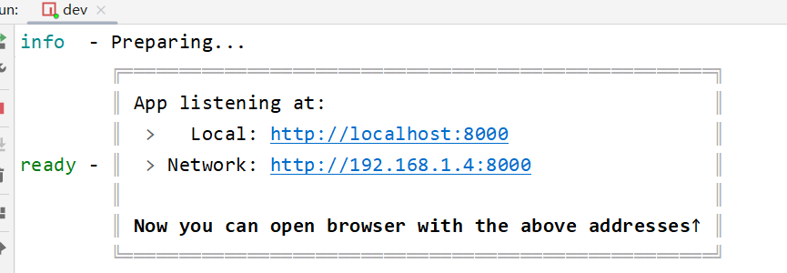

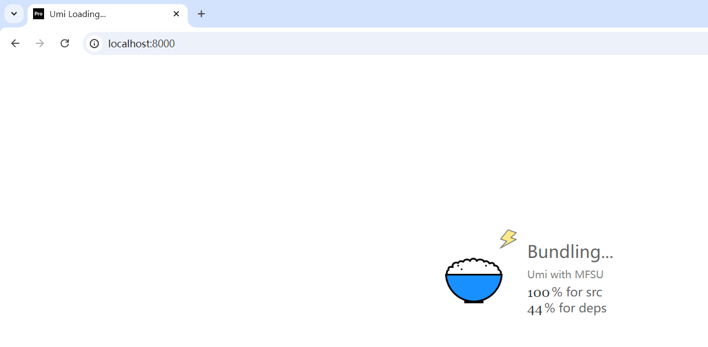

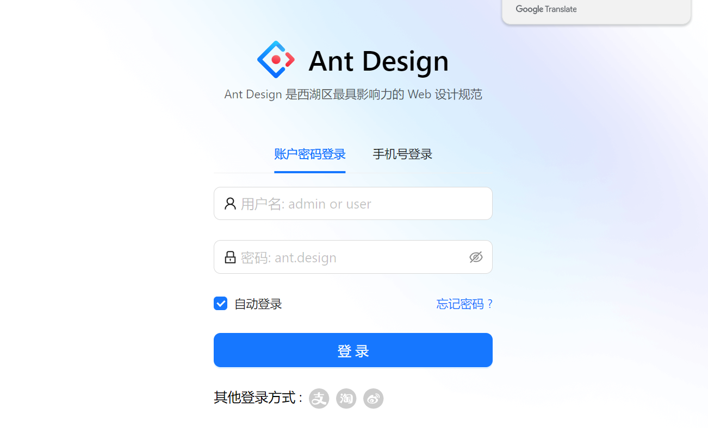

由于是用 dev 启动的 `cross-env REACT_APP_ENV=dev MOCK=none UMI_ENV=dev max dev`，所以没有 mock 假数据，导致登录不成功（这是必然的，因为没有写后端呀，但是 mock 技术可以让前端舒服点！）

start 启动后：

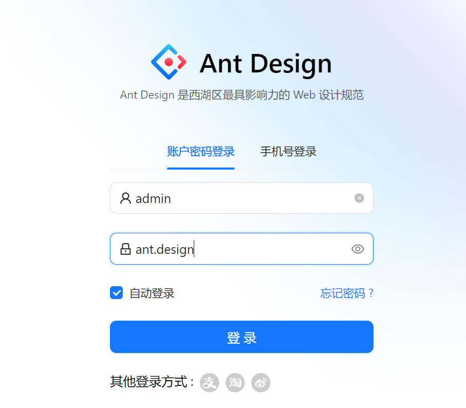

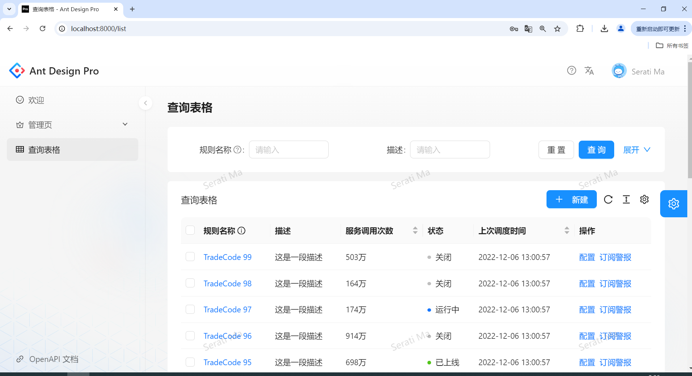

已经存在个自带的增删改查了！

> 果然，环境配置是一个难点啊。而且这种属于是需要本人操作过、解决过、记录过，才能印象深刻啊！