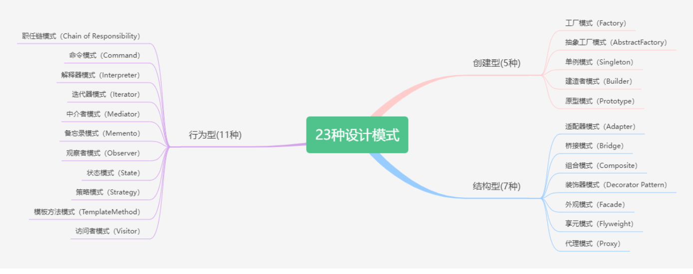
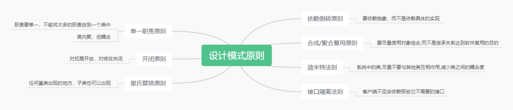

# 23 种设计模式介绍（Python 示例讲解）

链接：https://www.cnblogs.com/liugp/p/17134320.html

随笔：

1. 本文的这些设计模式相关内容适合入门，但是我认为漏了个最关键的点：什么场景下使用？这个非常关键。
2. 

## 一、概述

> `设计模式（Design Pattern）`是一套被广泛接受的、可重复使用的软件设计**解决方案**。它们是在软件开发过程中对常见问题的反复实践和总结得出的经验和思想的表现。

1995 年，GoF（Gang of Four，四人组/四人帮）合作出版了《设计模式：可复用面向对象软件的基础》一书，共收录了 **23 种设计模式**，从此树立了软件设计模式领域的里程碑，人称「GoF设计模式」。

设计模式是一种解决特定问题的经过测试和验证的通用解决方案，它们被广泛应用于软件工程和计算机科学中。下面列出了常见的 **23 种设计模式**：

1. **工厂模式（Factory Pattern）**：定义一个创建对象的接口，让子类决定实例化哪一个类。工厂方法使一个类的实例化延迟到其子类。

2. **抽象工厂模式（Abstract Factory Pattern）**：提供一个创建一系列相关或相互依赖对象的接口，而无需指定它们的具体类。

3. **单例模式（Singleton Pattern）**：确保一个类只有一个实例，并提供对该实例的全局访问点。

4. **建造者模式（Builder Pattern）**：将一个复杂对象的构建与它的表示分离，使得同样的构建过程可以创建不同的表示。

5. **原型模式（Prototype Pattern）**：通过复制现有的实例来创建新的对象，而不是使用构造函数。

6. **适配器模式（Adapter Pattern）**：将一个类的接口转换成客户希望的另一个接口。适配器模式可以让原本由于接口不兼容而不能在一起工作的类可以一起工作。

7. **桥接模式（Bridge Pattern）**：将抽象部分与它的实现部分分离，使它们都可以独立地变化。

8. **组合模式（Composite Pattern）**：将对象组合成树形结构以表示部分-整体的层次结构。组合模式使得用户对单个对象和组合对象的使用具有一致性。

   > Q：将对象组织成树形结构，是否可以理解成 MongoDB 的那种嵌套结构呢？

9. **装饰器模式（Decorator Pattern）**：动态地将责任附加到对象上。装饰器模式提供了一种灵活的替代继承的方式。

10. **外观模式（Facade Pattern）**：为子系统中的一组接口提供一个一致的界面，使得子系统更容易使用。

11. **享元模式（Flyweight Pattern）**：运用共享技术来有效地支持大量细粒度对象的复用。

12. **代理模式（Proxy Pattern）**：为其他对象提供一种代理以控制对这个对象的访问。代理对象可以在被代理对象执行操作前后进行一些预处理和后处理。

13. **责任链模式（Chain of Responsibility Pattern）**：为解除请求的发送者和接收者之间耦合，而使多个对象都有机会处理这个请求。

14. **命令模式（Command Pattern）**：将请求封装成一个对象，从而使你可以用不同的请求对客户进行参数化。命令模式也支持撤销操作。

15. **解释器模式（Interpreter Pattern）**：是一种行为型设计模式，它提供了一种方法，可以在运行时解释语言文法中的表达式，并执行相应的操作。

16. **迭代器模式（Iterator Pattern）**：提供一种方法顺序访问一个聚合对象中的各个元素，而又不暴露该对象的内部表示。

17. **中介者模式（Mediator Pattern）**：用一个中介对象来封装一系列的对象交互。中介者使各个对象不需要显式地相互作用，从而使其耦合松散，而且可以独立地改变它们之间的交互。

18. **备忘录模式（Memento Pattern）**：在不破坏封装性的前提下，捕获一个对象的内部状态，并在该对象之外保存这个状态。备忘录模式可以在需要时将对象恢复到先前的状态。

19. **观察者模式（Observer Pattern）**：定义对象间的一种一对多的依赖关系，使得每当一个对象状态发生改变时，所有依赖它的对象都会得到通知并自动更新。

20. **状态模式（State Pattern）**：允许对象在其内部状态发生改变时改变它的行为。对象看起来似乎修改了它的类。

21. **策略模式（Strategy Pattern）**：定义一系列算法，将每个算法都封装起来，并使它们之间可以互换。策略模式使得算法可以独立于使用它的客户而变化。

22. **模板方法模式 (Template Method Pattern)**：定义一个算法框架，并将一些步骤延迟到子类中实现，以便在不改变算法结构的情况下，允许子类重定义算法的某些步骤。

23. **访问者模式（Visitor Pattern）**：是一种行为型设计模式，它可以让你在不修改对象结构的前提下，定义作用于这些对象元素的新操作。

这些设计模式可以被分为三个类别：

- **创建型模式**：这些模式涉及对象的创建机制，并提供了一种将对象的创建和使用分离的方式。工厂模式、抽象工厂模式、单例模式、建造者模式和原型模式都属于这一类别。
- **结构型模式**：这些模式涉及将类或对象组合在一起形成更大的结构，并提供了一种简化设计的方式。适配器模式、桥接模式、组合模式、装饰器模式、外观模式、享元模式和代理模式都属于这一类别。
- **行为型模式**：这些模式涉及对象之间的通信和算法的分配，并提供了一种实现松散耦合的方式。责任链模式、命令模式、解释器模式、迭代器模式、中介者模式、备忘录模式、观察者模式、状态模式、策略模式、模板方法模式和访问者模式都属于这一类别。



## 二、设计模式七种原则



设计模式的七种原则通常被称为“SOLID原则”，是面向对象设计中的基本原则，能够帮助开发人员编写出更加灵活、可扩展、可维护的代码。这七个原则分别是：

- **单一职责原则（Single Responsibility Principle，SRP）**：一个类只负责一个职责或一个功能。这个原则强调的是**高内聚、低耦合**，可以降低类的复杂度，提高代码的可读性、可维护性和可重用性。
- **开闭原则（Open-Closed Principle，OCP）**：一个类的行为应该是**可扩展**的，但是**不可修改**。这个原则强调的是代码的可维护性和可扩展性，通过抽象化来避免修改已有代码的风险，从而降低软件维护的成本。
- **里氏替换原则（Liskov Substitution Principle，LSP）**：子类应该可以替换其父类并且不会影响程序的正确性。这个原则强调的是**面向对象的继承和多态特性**，通过保证子类的行为和父类一致，从而提高代码的可维护性和可扩展性。
- **接口隔离原则（Interface Segregation Principle，ISP）**：一个类不应该依赖它不需要的接口，即一个类对其它类的依赖应该**建立在最小的接口**上。这个原则强调的是接口设计的合理性，避免不必要的接口导致类之间的耦合性过高，从而提高代码的灵活性和可维护性。
- **依赖倒置原则（Dependency Inversion Principle，DIP）**：依赖于抽象而不是依赖于具体实现。这个原则强调的是代码的可扩展性和可维护性，通过**抽象化来减少组件之间的耦合性**，从而使得代码更加灵活、易于维护和扩展。
- **迪米特法则（Law of Demeter，LoD）**：也叫最少知识原则（Least Knowledge Principle，LKP），一个对象应当对其他对象有尽可能少的了解，不需要了解的内容尽量不要去了解。这个原则强调的是组件之间的**松耦合**，通过**减少组件之间的依赖关系**，提高代码的可维护性和可重用性。
- **组合/聚合复用原则（Composite/Aggregate Reuse Principle，CARP）**：**尽量使用组合或聚合关系**，而不是继承关系来达到代码复用的目的。这个原则强调的是通过组合和聚合的方式来实现代码复用，避免继承带来的一些问题，如父类和子类之间的强耦合性，从而提高代码的灵活性和可维护性。


## 三、设计模式示例讲解

### 创建型模式

#### 工厂模式

简单工厂模式


工厂方法模式


#### 抽象工厂模式

#### 单例模式

#### 建造者模式

#### 原型模式


### 结构型模式

#### 适配器模式

#### 桥接模式

#### 组合模式

#### 装饰模式

#### 外观模式

#### 享元模式

> **享元模式**（`Flyweight`）是一种结构型设计模式，它**通过共享对象来尽可能减少内存使用和对象数量**。在享元模式中，存在两种对象：**内部状态**（`Intrinsic State`）和**外部状态**（`Extrinsic State`）。内部状态指对象的共享部分，不随环境改变而改变；外部状态指对象的非共享部分，会随环境改变而改变。

实现思路：

- 享元模式的核心思想是**尽量重用已经存在的对象**，减少对象的创建和销毁，从而提高性能和节省内存。
- 它通常适用于需要大量创建对象的场景，但又不能因为对象过多而导致内存不足或性能降低的情况。


下面是一个简单的享元模式的示例，假设我们有一个字符工厂，它可以创建不同的字符对象。在实现字符对象时，我们发现有一些字符会被频繁使用，而且它们的状态是不变的，例如空格、逗号、句号等标点符号。因此，我们可以将这些字符设计为享元对象，通过共享来节省内存。

```python
class CharacterFactory:
    def __init__(self):
        self.characters = {}

    def get_character(self, character):
        if character in self.characters:
            return self.characters[character]
        else:
            new_character = Character(character)
            self.characters[character] = new_character
            return new_character

class Character:
    def __init__(self, character):
        self.character = character

    def render(self, font):
        print(f"Rendering character {self.character} in font {font}")

# 创建字符工厂
factory = CharacterFactory()

# 获取不同的字符
char1 = factory.get_character("A")
char2 = factory.get_character("B")
char3 = factory.get_character(" ")
char4 = factory.get_character(",")
char5 = factory.get_character(" ")
char6 = factory.get_character(".")

# 渲染不同的字符
char1.render("Arial")
char2.render("Times New Roman")
char3.render("Arial")
char4.render("Times New Roman")
char5.render("Arial")
char6.render("Times New Roman")

```

代码讲解：

- 在上述示例中，我们创建了一个 CharacterFactory 类来管理字符对象。当客户端需要获取一个字符时，可以调用 get_character 方法。如果该字符已经被创建过了，就直接返回共享的对象；否则，创建一个新的对象并将其保存到工厂中，以备下次使用。
- 字符对象 Characte r有一个 render 方法，用于渲染该字符。在实际使用中，我们可能需要给不同的字符设置不同的字体，这里只是为了演示方便，用字符串代替了字体对象。
- 通过享元模式，我们可以共享多个相同的字符对象，从而减少内存使用和对象数量。在这个例子中，如果没有使用享元模式，我们可能需要创建多个空格、逗号和句号对象，而这些对象的状态都是不变的，这样就会导致内存浪费。通过使用享元模式，我们可以将这些相同的对象共享起来，避免重复创建对象，从而提高性能和节省内存。

> 需要注意的是，享元模式并不是万能的，它**适用于需要大量创建相同对象的场景**。如果对象的数量不大，或者对象状态变化频繁，那么使用享元模式可能会增加代码复杂度，而且也不一定能够带来性能提升。因此，在使用享元模式时需要仔细考虑是否适合当前场景。

**补充说明：**

【一言以蔽之】缓存机制，比如：字符串连接的时候，可以选择 `res=[] "\n".join(res)`的方式实现。


#### 代理模式


### 行为型模式

> 2024-10-06：行为型模式属于全是重点啊！感觉全部都有用！

#### 责任链模式

> **职责链模式**（Chain of Responsibility）是一种行为型设计模式，它**通过将请求的发送者和接收者解耦**，从而使多个对象都有机会处理这个请求。

实现思路：

- 在职责链模式中，我们定义一系列的处理器对象，每个处理器对象都包含一个对下一个处理器对象的引用。

- 当请求从客户端发送到处理器对象时，第一个处理器对象会尝试处理请求，如果它不能处理请求，则将请求传递给下一个处理器对象，以此类推，直到请求被处理或者所有的处理器对象都不能处理请求。

  > 此处应该可以类别 Django 接收到请求的过程吧？process_request、process_view 等。
  >
  > Django 的中间层应该也算吧？
  >
  > 责任链模式：HandlerA、HandlerB、HandlerC 等。

优缺点：

- 职责链模式的**优点**是它可以**灵活地配置处理器对象的顺序和组合**，从而满足不同的处理需求。它还可以**将请求的发送者和接收者解耦**，从而提高系统的灵活性和可扩展性。
- 职责链模式的**缺点**是如果**处理器对象过多或者处理器对象之间的关系过于复杂**，可能会导致系统的维护难度增加。

职责链模式通常涉及以下角色：

- **处理器接口（Handler Interface）**：定义处理器对象的接口，包含处理请求的方法和对下一个处理器对象的引用。
- **具体处理器类（Concrete Handlers）**：实现处理器接口，处理请求或将请求传递给下一个处理器对象。
- **客户端（Client）**：创建处理器对象的链，将请求发送给链的第一个处理器对象。

下面是一个简单的 Python 实现示例：

1、定义处理器接口：

```python
class Handler:
    def set_next(self, handler):
        pass

    def handle(self, request):
        pass

```

2、实现具体处理器类：

```python
class AbstractHandler(Handler):
    def __init__(self):
        self._next_handler = None

    def set_next(self, handler):
        self._next_handler = handler
        return handler

    def handle(self, request):
        if self._next_handler:
            return self._next_handler.handle(request)
        return None

class ConcreteHandler1(AbstractHandler):
    def handle(self, request):
        if request == "request1":
            return "Handled by ConcreteHandler1"
        else:
            return super().handle(request)

class ConcreteHandler2(AbstractHandler):
    def handle(self, request):
        if request == "request2":
            return "Handled by ConcreteHandler2"
        else:
            return super().handle(request)

class ConcreteHandler3(AbstractHandler):
    def handle(self, request):
        if request == "request3":
            return "Handled by ConcreteHandler3"
        else:
            return super().handle(request)

```

3、客户端创建处理器对象的链：

```python
handler1 = ConcreteHandler1()
handler2 = ConcreteHandler2()
handler3 = ConcreteHandler3()

handler1.set_next(handler2).set_next(handler3)

# 发送请求
requests = ["request1", "request2", "request3", "request4"]
for request in requests:
    response = handler1.handle(request)
    if response:
        print(response)
    else:
        print(f"{request} was not handled")


```

代码讲解：

- 上面的示例中，我们定义了一个处理器接口 Handler，其中包含 set_next 和 handle 方法。
- 我们还定义了一个抽象处理器类 AbstractHandler，它实现了 set_next 和 handle 方法，其中 handle 方法调用了下一个处理器对象的 handle 方法。
- 我们还实现了三个具体的处理器类 ConcreteHandler1、ConcreteHandler2 和 ConcreteHandler3，它们分别实现了自己的 handle 方法。
- 客户端创建处理器对象的链，将处理器对象按照需要连接起来，然后将请求发送给链的第一个处理器对象，处理器对象将请求进行处理或者将请求传递给下一个处理器对象，直到请求被处理或者没有处理器对象能够处理请求。
- 在这个例子中，当请求为 "request1"、"request2"、"request3" 时，请求会被相应的处理器对象处理；当请求为 "request4" 时，没有处理器对象能够处理该请求，因此该请求未被处理。

总的来说，职责链模式可以**使多个对象都有机会处理请求**，并且可以灵活地配置处理器对象的顺序和组合，从而提高系统的灵活性和可扩展性。

#### 命令模式

> **命令模式**（Command）是一种行为型设计模式，它**将请求封装成一个对象**，从而使您可以**将不同的请求与其请求的接收者分开**。这种模式的目的是通过将请求**发送者和请求接收者解耦**来实现请求的发送、执行和撤销等操作。
>
> 注意，将请求封装成一个对象，那么这个对象的构造函数显然至少有个参数代表该请求的接收者，可以理解为这本就应该是请求的一个属性（毕竟请求总归需要接收者）

实现思路：

- 在命令模式中，我们定义一个 Command 接口，该接口包含一个 execute 方法，用于执行命令。
- 我们还定义了一个 Invoker 类，它用于发送命令，可以接受一个 Command 对象，并在需要时调用该对象的 execute 方法。
- 我们还定义了一个 Receiver 类，它实际执行命令，包含一些特定于应用程序的业务逻辑。

命令模式涉及以下角色：

- **Command 接口**：定义了一个执行命令的方法 execute。
- **具体命令类（Concrete Command）**：实现了 Command 接口，实现 execute 方法，包含一个接收者对象，执行具体的业务逻辑。
- **Invoker 类**：负责发送命令，它包含一个 Command 对象，可以在需要时调用该对象的 execute 方法。
- **Receiver 类**：包含一些特定于应用程序的业务逻辑，实际执行命令。

下面是一个简单的 Python 实现示例：

```python
from abc import ABC, abstractmethod

# Command 接口
class Command(ABC):
    @abstractmethod
    def execute(self):
        pass

# 具体命令类
class LightOnCommand(Command):
    def __init__(self, light):
        self.light = light

    def execute(self):
        self.light.turn_on()

# Invoker 类
class LightOffCommand(Command):
    def __init__(self, light):
        self.light = light

    def execute(self):
        self.light.turn_off()

# Receiver 类
class RemoteControl:
    def __init__(self):
        self.commands = []

    def add_command(self, command):
        self.commands.append(command)

    def execute_commands(self):
        for command in self.commands:
            command.execute()

class Light:
    def turn_on(self):
        print("The light is on")

    def turn_off(self):
        print("The light is off")


light = Light()

remote_control = RemoteControl()
remote_control.add_command(LightOnCommand(light))
remote_control.add_command(LightOffCommand(light))

remote_control.execute_commands()

         
```

代码解释：

- 在这个例子中，我们首先定义了一个 Command 接口，该接口包含 execute 方法。然后，我们定义了两个具体命令类 LightOnCommand 和 LightOffCommand，它们实现了 Command 接口，并包含一个接收者对象 Light，实现了执行具体的业务逻辑。
- 我们还定义了一个 Invoker 类 RemoteControl，它包含一个 Command 对象的列表，并提供了一个 add_command 方法用于添加 Command 对象。execute_commands 方法用于在需要时调用 Command 对象的 execute 方法。
- 最后，我们定义了一个 Receiver 类 Light，它包含一些特定于应用程序的业务逻辑，实际执行命令。
- 在客户端代码中，我们创建了一个 Light 对象和一个 RemoteControl 对象。我们将 LightOnCommand 和 LightOffCommand 对象添加到 RemoteControl 对象的命令列表中，然后调用 execute_commands 方法来执行这些命令。

当我们执行这个程序时，它将输出以下内容：

```python
The light is on
The light is off
```

- 这是因为我们创建了一个 Light 对象，然后使用 LightOnCommand 和 LightOffCommand 对象分别打开和关闭该对象。通过将命令对象和命令的接收者对象分开，我们可以轻松地添加、删除和替换命令，同时也使得程序更加灵活和可扩展。

  > Light 是命令（请求）的接收者，Command 就是请求的发送者吗？还是说发送者是 RemoteControl？

总的来说，命令模式提供了一种通过将请求封装成对象来实现请求的发送、执行和撤销的方法，从而使得命令对象和命令接收者对象解耦，提高程序的灵活性和可扩展性。

> 《Header First》这本书里的命名模式的样例比这里的详细，但是罢了。简单过一遍而已，设计模式在实战中才能巩固，虽然我觉得目前很难有机会在实战中练习，多做项目应该好点。（2024-10-09）

#### ==解释器模式==

> **解释器模式**（Interpreter Pattern）是一种行为型设计模式，它**定义了一种语言文法**，以及一个解释器，用于解释该语言中的句子。解释器模式通常用于解决特定类型的问题，例如解释计算器表达式，SQL 查询语句等。

解释器模式包括三个核心角色：

- **Context（上下文）**：它是解释器的运行环境。它存储解释器所需的一些全局信息。
- **Abstract Expression（抽象表达式）**：它是定义所有表达式的接口，通常包含解释方法 interpret()。
- **Concrete Expression（具体表达式）**：它实现抽象表达式接口，用于解释特定类型的表达式。

下面是解释器模式的 Python 实现示例：

```python
import typing as t


class Context:
    def __init__(self):
        self._variables = {}

    def set_variable(self, name: str, value):
        self._variables[name] = value

    def get_variable(self, name):
        return self._variables.get(name)


class Expression:
    def interpret(self, context: Context):
        raise NotImplementedError


class VariableExpression(Expression):
    def __init__(self, name):
        self._name = name

    def interpret(self, context):
        return context.get_variable(self._name)


class ConstantExpression(Expression):
    def __init__(self, value):
        self._value = value

    def interpret(self, context):
        return self._value


class AddExpression(Expression):
    def __init__(self, left: Expression, right: Expression):
        self._left = left
        self._right = right

    def interpret(self, context):
        return self._left.interpret(context) + self._right.interpret(context)


class SubtractExpression(Expression):
    def __init__(self, left: Expression, right: Expression):
        self._left = left
        self._right = right

    def interpret(self, context):
        return self._left.interpret(context) - self._right.interpret(context)


if __name__ == "__main__":
    # 测试代码
    context_ = Context()
    a = ConstantExpression(1)
    b = ConstantExpression(2)
    c = ConstantExpression(3)
    x = VariableExpression('x')
    y = VariableExpression('y')

    context_.set_variable('x', 10)
    context_.set_variable('y', 5)

    # 1 + 2 + 3 = 6
    expression = AddExpression(AddExpression(a, b), c)
    result = expression.interpret(context_)
    print(result)

    # 10 - 2 + 5 = 13
    expression = AddExpression(SubtractExpression(x, b), y)
    result = expression.interpret(context_)
    print(result)

```

代码解释：

- 在上面的实现中，我们定义了一个 Context 类来表示解释器的运行环境，它存储解释器所需的一些全局信息。
- Expression 类是抽象表达式类，包含一个 interpret 方法用于解释表达式。VariableExpression 和 ConstantExpression 类是具体表达式类，用于解释变量和常量。
- AddExpression 和 SubtractExpression 类是具体表达式类，用于解释加法和减法表达式。

**补充说明：**

我不明白，这个代码示例没感觉到具体的作用。

#### ==迭代器模式==

> **迭代器模式**（Iterator）是一种行为型设计模式，它允许你在**不暴露集合底层实现的情况下遍历集合中的所有元素**。

实现思路：

- 在迭代器模式中，集合类（如列表、树等）将遍历操作委托给一个迭代器对象，而不是直接实现遍历操作。
- 迭代器对象负责实现遍历操作，以及保存当前遍历位置等状态。
- 这样，集合类就可以将遍历操作与集合底层实现解耦，从而使得集合类更加简单、灵活和易于维护。

迭代器模式通常由以下几个角色组成：

- **迭代器（Iterator）**：定义了迭代器的接口，包含用于遍历集合元素的方法，如 next()、has_next() 等。
- **具体迭代器（ConcreteIterator）**：实现了迭代器接口，负责实现迭代器的具体遍历逻辑，以及保存当前遍历位置等状态。
- **集合（Aggregate）**：定义了集合的接口，包含用于获取迭代器对象的方法，如 create_iterator() 等。
- **具体集合（ConcreteAggregate）**：实现了集合接口，负责创建具体迭代器对象，以便遍历集合中的元素。

迭代器模式的优缺点包括：

- 将遍历操作与集合底层实现解耦，使得集合类更加灵活和易于维护。
   简化了集合类的接口，使得集合类更加简单明了。
- 提供了对不同类型的集合统一遍历的机制，使得算法的复用性更加高。
- 迭代器模式的**缺点**是，由于迭代器对象需要保存遍历位置等状态，因此它可能会占用比较大的内存。此外，由于迭代器对象需要负责遍历逻辑，因此它可能会变得比较复杂。

以下是迭代器模式的一个简单示例，实现了一个列表类和一个列表迭代器类：

```python
from abc import ABC, abstractmethod


# 抽象迭代器类
class Iterator(ABC):
    @abstractmethod
    def has_next(self):
        pass

    @abstractmethod
    def next(self):
        pass


# 具体迭代器类
class ConcreteIterator(Iterator):
    def __init__(self, data):
        self.data = data
        self.index = 0

    def has_next(self):
        return self.index < len(self.data)

    def next(self):
        if self.has_next():
            value = self.data[self.index]
            self.index += 1
            return value


# 抽象聚合类
class Aggregate(ABC):
    @abstractmethod
    def create_iterator(self):
        pass


# 具体聚合类
class ConcreteAggregate(Aggregate):
    def __init__(self, data):
        self.data = data

    def create_iterator(self):
        return ConcreteIterator(self.data)


# 测试
if __name__ == "__main__":
    data = [1, 2, 3, 4, 5]
    aggregate = ConcreteAggregate(data)
    iterator = aggregate.create_iterator()
    while iterator.has_next():
        print(iterator.next())

```

代码解释：

- 以上代码中，我们首先定义了抽象迭代器类 Iterator，其中定义了两个抽象方法 has_next 和  next，分别用于判断是否还有下一个元素和返回下一个元素。然后，我们定义了具体迭代器类 ConcreteIterator，它包含了一个数据列表  data 和一个指针 index，它实现了 has_next 和 next 方法。
- 接着，我们定义了抽象聚合类 Aggregate，其中定义了一个抽象方法  create_iterator，用于创建迭代器对象。然后，我们定义了具体聚合类 ConcreteAggregate，它包含了一个数据列表  data，它实现了 create_iterator 方法，返回一个 ConcreteIterator 对象。
- 最后，在测试代码中，我们创建了一个数据列表 data，然后创建了一个具体聚合对象 aggregate，并通过  create_iterator 方法创建了一个具体迭代器对象 iterator，然后使用 while  循环遍历该聚合对象中的各个元素，打印出每个元素的值。

这样，迭代器模式的基本结构就完成了。我们可以通过定义不同的聚合类和迭代器类来实现不同的聚合对象和迭代方式。这样，迭代器模式可以提高程序的灵活性和可扩展性。

**补充说明：**

对于 Python 而言，`__iter__`等魔术方法的存在让迭代器模式随手即可实现。


#### ==中介者模式==

【Questions】

1. 该设计模式的使用场景是什么？个人认为可能和 Java 这种纯面向对象语言关系较大。

> **中介者模式**（Mediator）是一种行为型设计模式，它用于**将多个对象之间的交互解耦**，从而使得对象之间的通信更加简单和灵活。

实现思路：

- 在中介者模式中，多个对象之间不直接相互通信，而是通过一个中介者对象进行通信。
- 这样，**每个对象只需要和中介者对象通信，而不需要知道其他对象的存在**。
- **中介者对象负责协调各个对象之间的交互**，使得系统更加灵活和易于维护。

中介者模式通常由以下几个角色组成：

- **抽象中介者（Mediator）**：定义了各个同事对象之间交互的接口，它通常包含一个或多个抽象方法，用于定义各种交互操作。

  > 接口的作用是定义一些既定操作，其他对象可以面向接口编程（具体实现必定会实现接口定义的所有操作），其他对象只需要了解这些操作的语义并使用即可！

- **具体中介者（ConcreteMediator）**：实现了抽象中介者接口，负责协调各个同事对象之间的交互关系。

- **抽象同事类（Colleague）**：定义了各个同事对象的接口，包含一个指向中介者对象的引用，以便与中介者进行通信。

  > Q：这个抽象同事类是为何呢？Python 的多重继承和 Java 的单继承 + 多接口是否能相互兼容呢？如果是 Java 的多接口就好理解多了。某个类实现这个同事接口即可。

- **具体同事类（ConcreteColleague）**：实现了抽象同事类的接口，负责实现各自的行为，并且需要和中介者对象进行通信。

中介者模式的优缺点包括：

- **解耦**了各个对象之间的交互关系，使得系统更加灵活和易于维护。
- 降低了系统的复杂度，使得各个对象之间的交互变得简单明了。
- 可以集中管理各个对象之间的交互关系，从而提高系统的可维护性和可扩展性。
- 中介者模式的**缺点**是，由于中介者对象需要负责协调各个同事对象之间的交互关系，因此它的职责可能会变得非常复杂。另外，由于中介者对象需要了解各个同事对象之间的交互关系，因此它可能会变得比较庞大。

下面是一个简单的中介者模式的 Python 实现，该实现使用一个聊天室作为中介者，多个用户作为同事类：

> ChatRoom 作为中介者，多个 User 作为同事类
>
> 2024-10-06：当前我认为，下面这个例子和观察者模式很相似。

```python
from typing import List

class User:
    def __init__(self, name: str, mediator):
        self.name = name
        self.mediator = mediator

    def send_message(self, message: str):
        self.mediator.send_message(message, self)

    def receive_message(self, message: str):
        print(f"{self.name} received message: {message}")

class ChatRoom:
    def __init__(self):
        self.users: List[User] = []

    def add_user(self, user: User):
        self.users.append(user)

    def send_message(self, message: str, sender: User):
        for user in self.users:
            if user != sender:
                user.receive_message(f"{sender.name}: {message}")

if __name__ == '__main__':
    chat_room = ChatRoom()

    alice = User("Alice", chat_room)
    bob = User("Bob", chat_room)
    charlie = User("Charlie", chat_room)

    chat_room.add_user(alice)
    chat_room.add_user(bob)
    chat_room.add_user(charlie)

    alice.send_message("Hi everyone!")
    bob.send_message("Hello Alice!")
    charlie.send_message("Hey guys, what's up?")

```

代码解释：

- 在上面的示例中，User 类表示同事类，ChatRoom 类表示中介者。
- 每个 User 对象都有一个指向 ChatRoom 对象的引用，以便与中介者进行通信。
- 当一个用户发送消息时，它会将消息发送到中介者，然后中介者会将消息广播给其他用户。

这个简单的实现演示了中介者模式的基本思想，尽管它没有实现一个完整的中介者模式。实际上，中介者模式通常需要更复杂的实现，以便处理更复杂的交互关系。


#### 备忘录模式

> **备忘录模式**（Memento）是一种行为型设计模式，它**允许在不暴露对象实现细节的情况下保存和恢复对象的内部状态**。备忘录模式的**核心是备忘录类**，它用于存储对象的状态信息，同时提供给其他类访问状态信息的接口。

备忘录模式包括三个核心角色：

- **Originator（发起人）**：它是需要保存状态的对象。它创建备忘录对象来存储内部状态，并可以使用备忘录对象来恢复其先前的状态。
- **Memento（备忘录）**：它是存储发起人对象内部状态的对象。备忘录对象由发起人创建，并由发起人决定何时读取备忘录以恢复其先前的状态。
- **Caretaker（管理者）**：它负责备忘录的安全保管。它只能将备忘录传递给其他对象，不能修改备忘录的内容。

> 根据上述描述，我有以下归纳：
>
> 1. 首先需要一个备忘录仓库，其次需要一个备忘录。
>
> 2. 个人认为，参考饥荒联机版的 OnSave 和 OnLoad 函数即可。
> 3. Memento 类和 Originator 类是绑定的，其实可以理解为：一个类需要一个与其对应的序列化类。

在 Python 中，备忘录模式通常使用 Python 的内置 copy 模块和 **dict** 属性来实现。下面是一个简单的备忘录模式的 Python 实现：

```python
import copy


# 发起人类
class Originator:
    def __init__(self):
        self._state = None

    def set_state(self, state):
        print("设置状态为：", state)
        self._state = state

    def create_memento(self):
        print("创建备忘录")
        # 个人认为，参考饥荒联机版的 OnSave 和 OnLoad 函数即可
        return Memento(copy.deepcopy(self._state))

    def restore_memento(self, memento):
        print("恢复备忘录")
        self._state = memento.get_state()

    def show_state(self):
        print("当前状态为：", self._state)


# 备忘录类
class Memento:
    # 该类和 Originator 类是绑定的，其实可以理解为：一个类需要一个与其对应的序列化类
    def __init__(self, state):
        self._state = state

    def get_state(self):
        return self._state


# 管理者类
class Caretaker:
    def __init__(self):
        self._mementos = []

    def add_memento(self, memento):
        self._mementos.append(memento)

    def get_memento(self, index):
        return self._mementos[index]


# 测试
if __name__ == "__main__":
    originator = Originator()
    caretaker = Caretaker()

    originator.set_state("状态1")
    caretaker.add_memento(originator.create_memento())

    originator.set_state("状态2")
    caretaker.add_memento(originator.create_memento())

    originator.set_state("状态3")
    originator.show_state()

    originator.restore_memento(caretaker.get_memento(1))
    originator.show_state()

    originator.restore_memento(caretaker.get_memento(0))
    originator.show_state()

```

代码解释：

- 以上代码中，我们首先定义了发起人类 Originator，其中包含一个状态变量  _state，以及用于设置状态、创建备忘录和恢复备忘录的方法。在 create_memento 方法中，我们通过 copy.deepcopy  方法创建了一个状态信息的备忘录对象。在 restore_memento 方法中，我们通过备忘录对象的 get_state  方法获取备忘录中的状态信息，然后将其恢复到当前的状态变量中。在 show_state 方法中，我们打印出当前状态的值。
- 接着，我们定义了备忘录类 Memento，它包含了一个状态信息的属性 _state，以及一个用于获取该属性的方法 get_state。
- 最后，我们定义了管理者类 Caretaker，它包含了一个备忘录列表 _mementos，以及用于添加备忘录和获取备忘录的方法。

#### ==观察者模式==

> **观察者模式**（Observer）是一种软件设计模式，它定义了对象之间的一种一对多的依赖关系，使得当一个对象的状态发生改变时，所有依赖它的对象都会收到通知并自动更新。这个模式也被称为**发布/订阅模式**（Publish/Subscribe），**事件模型**（Event Model）或**消息机制**（Message Pattern）。

实现思路：

- 在观察者模式中，有两种类型的对象：**观察者**和**主题（Subject）**。
- **主题是被观察的对象**，它维护了一个观察者列表，用于记录所有依赖于它的观察者。
- 当主题状态发生变化时，它会自动通知所有观察者，让它们能够及时更新自己的状态。
- **观察者是依赖于主题的对象**，当主题状态发生变化时，它们会收到通知并根据新状态更新自己的状态。

优缺点：

- 观察者模式的**优点**是它实现了**松耦合**（loose  coupling）的设计，因为主题和观察者之间没有直接的依赖关系。这使得程序更加灵活，能够更容易地扩展和修改。观察者模式也使得对象能够以可预测的方式进行通信，因为主题和观察者都遵循了同一种接口。同时，观察者模式也可以提高程序的可维护性，因为它将功能分散到了不同的对象中，使得每个对象都具有清晰的职责。
- 观察者模式的**缺点**是，它可能会导致过多的细节传递，因为主题在通知观察者时必须传递详细信息。这**可能会导致性能问题或安全问题**，因为观察者可以访问到主题的私有信息。同时，观察者模式也**可能导致循环依赖的问题**，因为主题和观察者之间可能会相互依赖。

以下是观察者模式的 Python 实现：

```python
import abc


# 2024-10-08
# Q: 继承 abc.ABC 的类算是接口吧？还是类似 Java 的抽象类，支持默认函数？
# A: 运行的时候没发现什么问题，得去看看代码规范建议不建议这样做。

class Subject(abc.ABC):
    def __init__(self):
        self._observers = set()

    def attach(self, observer):
        """ 注册观察者（观察者订阅） """
        self._observers.add(observer)

    def detach(self, observer):
        """ 注销观察者（观察者取消订阅） """
        if observer in self._observers:
            self._observers.remove(observer)

    def notify(self, modifier=None):
        """ 广播 """
        for observer in self._observers:
            # 中介者模式的样例代码和观察者模式区别并不大，这是为何呢？是不是中介者模式的样例不够鲜明。
            if modifier != observer:
                # 观察者模式的缺点是，
                # 它可能会导致过多的细节传递，因为主题在通知观察者时必须传递详细信息。
                # 这可能会导致性能问题或安全问题，因为观察者可以访问到主题的私有信息。
                observer.update(self)


class Observer(abc.ABC):
    @abc.abstractmethod
    def update(self, subject):
        pass


class ConcreteSubject(Subject):
    def __init__(self):
        super().__init__()
        self._state = None

    @property
    def state(self):
        return self._state

    @state.setter
    def state(self, state):
        # 该被观察者的状态发生变化时，通知所有订阅方。订阅方会调用它自己实现的 update 函数。
        self._state = state
        self.notify()


class ConcreteObserver(Observer):
    def __init__(self, name):
        self._name = name

    def update(self, subject):
        print(f'{self._name} received an update: {subject.state}')


def unittest():
    # 测试驱动开发？这类知识，找到个稳定的工作再说吧。目前最主要的还是工程实践也就是项目经验。（2024-10-08）
    subject = ConcreteSubject()
    observer1 = ConcreteObserver('Observer 1')
    observer2 = ConcreteObserver('Observer 2')
    subject.attach(observer1)
    subject.attach(observer2)

    subject.state = 123
    subject.detach(observer1)

    subject.state = 456


if __name__ == '__main__':
    unittest()

```

代码讲解：

- 在上面的实现中，Subject 是主题类，Observer 是观察者类，ConcreteSubject 是具体主题类，ConcreteObserver 是具体观察者类。
- 当主题状态发生变化时，它会通过 notify 方法通知所有观察者。
- 观察者可以通过 update 方法接收到主题的状态变化，并进行相应的处理。
- 在上面的例子中，我们创建了一个 ConcreteSubject 对象，然后创建了两个 ConcreteObserver 对象，并将它们添加到主题的观察者列表中。
- 接着，我们改变了主题的状态两次，第一次时两个观察者都收到了通知，第二次时只有一个观察者收到了通知。
- 最后，我们从主题的观察者列表中移除了一个观察者，并再次改变了主题的状态，这时只有一个观察者收到了通知。

#### 状态模式

#### 策略模式

#### 模板方法模式

#### ==访问者模式==

> **访问者模式**（Visitor）是一种行为型设计模式，它**可以将算法与其所作用的对象分离开来**。这种模式允许你在不改变现有对象结构的情况下向对象结构中添加新的行为。

实现思路：

- 访问者模式的核心思想是：将算法封装到访问者对象中，然后将访问者对象传递给对象结构中的元素，以便这些元素可以调用访问者对象中的算法。
- 访问者对象可以通过访问元素中的数据和操作来实现算法，从而避免了对元素结构的直接访问。

访问者模式通常由以下几个角色组成：

- **访问者（Visitor）**：定义了用于访问元素的方法，这些方法通常以不同的重载形式出现，以便针对不同类型的元素采取不同的行为。

  > 各种与某个元素绑定的方法被封装到了 Visitor 里，元素类中的 accept 函数的第一个参数是 visitor 实例，然后调用 visitor 中与当前元素绑定的方法

- **具体访问者（ConcreteVisitor）**：实现了访问者接口，提供了算法的具体实现。

- **元素（Element）**：定义了用于接受访问者的方法，这些方法通常以 accept() 的形式出现，以便元素可以将自己作为参数传递给访问者对象。

- **具体元素（ConcreteElement）**：实现了元素接口，提供了具体的数据和操作，同时也提供了接受访问者的方法。

- **对象结构（Object Structure）**：定义了元素的集合，可以提供一些方法以便访问者能够遍历整个集合。

  > 各种元素注册进 object structure 中，其中的 accept 函数将实现：遍历所有元素并调用该元素对应的 accept 函数。

访问者模式的优缺点包括：

- 可以将算法与其所作用的对象分离开来，避免了对元素结构的直接访问。
  在访问者中可以实现对元素数据和操作的访问和处理，从而可以方便地扩展新的操作和处理逻辑。

- 可以方便地实现元素结构的复杂算法，而不需要修改元素结构本身。

  > Object Structure、Element 类的结构不需要变化，逻辑需要变动的时候统一改动 Visitor 即可？

- 访问者模式的**缺点**是，它可能会导致访问者对象的复杂性增加。此外，它也可能会导致元素结构的扩展性变得比较差，因为每当添加一个新的元素类型时，都需要修改所有的访问者对象。

  > Q: 什么叫需要修改所有的访问者对象？为什么需要修改对象？这也没有继承吧？源代码也不用动吧？

下面是一个简单的访问者模式的 Python 实现：

```python
from abc import ABC, abstractmethod

# 抽象元素类
class Element(ABC):
    @abstractmethod
    def accept(self, visitor):
        pass

# 具体元素类A
class ElementA(Element):
    def __init__(self, value):
        self.value = value

    def accept(self, visitor):
        visitor.visit_element_a(self)

# 具体元素类B
class ElementB(Element):
    def __init__(self, value):
        self.value = value

    def accept(self, visitor):
        visitor.visit_element_b(self)

# 抽象访问者类
class Visitor(ABC):
    @abstractmethod
    def visit_element_a(self, element_a):
        pass

    @abstractmethod
    def visit_element_b(self, element_b):
        pass

# 具体访问者类A
class VisitorA(Visitor):
    def visit_element_a(self, element_a):
        print("VisitorA is visiting ElementA, value = ", element_a.value)

    def visit_element_b(self, element_b):
        print("VisitorA is visiting ElementB, value = ", element_b.value)

# 具体访问者类B
class VisitorB(Visitor):
    def visit_element_a(self, element_a):
        print("VisitorB is visiting ElementA, value = ", element_a.value)

    def visit_element_b(self, element_b):
        print("VisitorB is visiting ElementB, value = ", element_b.value)

# 对象结构类
class ObjectStructure:
    def __init__(self):
        self.elements = []

    def attach(self, element):
        self.elements.append(element)

    def detach(self, element):
        self.elements.remove(element)

    def accept(self, visitor):
        for element in self.elements:
            element.accept(visitor)

# 测试
if __name__ == "__main__":
    object_structure = ObjectStructure()
    element_a = ElementA("A")
    element_b = ElementB("B")
    object_structure.attach(element_a)
    object_structure.attach(element_b)
    visitor_a = VisitorA()
    visitor_b = VisitorB()
    object_structure.accept(visitor_a)
    object_structure.accept(visitor_b)


```

代码解释：

- 以上代码中，我们首先定义了抽象元素类 Element，其中定义了一个 accept 方法，该方法**接受一个访问者对象作为参数**，并调用访问者对象的访问方法。然后，我们定义了两个具体元素类 ElementA 和 ElementB，它们分别实现了 accept 方法。
- 接着，我们定义了抽象访问者类 Visitor，其中定义了两个访问方法 visit_element_a 和 visit_element_b，这两个方法分别用于访问具体的元素类。然后，我们定义了两个具体访问者类 VisitorA 和 VisitorB，它们分别实现了 visit_element_a 和 visit_element_b 方法。
- 最后，我们定义了一个对象结构类 ObjectStructure，它包含了多个元素对象，并提供了 attach、detach 和 accept 方法，其中 accept 方法接受一个访问者对象作为参数，并调用元素对象的 accept 方法。在测试代码中，我们创建了一个对象结构，向其中添加了两个具体元素对象，并创建了两个具体访问者对象。然后，我们先使用 VisitorA 对象访问对象结构中的元素对象，再使用 VisitorB 对象访问对象结构中的元素对象。
- 这样，访问者模式的基本结构就完成了。我们可以通过定义不同的具体访问者类来实现不同的操作，而不需要修改元素类。这样，访问者模式可以提高程序的灵活性和可扩展性。

