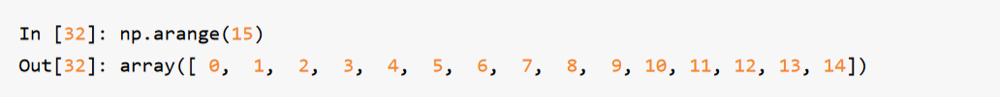

## 我的笔记

### 随笔

1. 在多维数组中，如果省略了后面的索引，则返回对象会是一个维度低一点的ndarray（它含有高一
   级维度上的所有数据）。

   > 本句话的意思是：假如 arr 是三维数组，则 arr[0] 是二维数组，降维了。

2. 对于电子书的阅读，如果没有合适的阅读工具的话，假如纸质书看一遍能记住 50%，电子书最多 30%！

   > 举个例子：电子书阅读后面的内容时很难翻到前面对应起来，除非双屏... 难受...

3. numpy 对矩阵的操作（如算数操作），会作用到矩阵的每个元素上！

4. 

### 阅读笔记


#### 第 4 章


> 注意，以下部分为模板，即 markdown 的最佳实践
>
> # 第 4 章
>
> ## 4.1 Numpy 和 ndarray：一种多维数组对象
>
> 正文
>
> ```python
> print(1)
> ```
>
> > 注意事项
>
> ### 创建 ndarray
>
> 代码：
>
> ```python
> print(123)
> ```
>
> 图片：
>
> 
>
> 表格：
>
> | 函数  | 说明                                                        |
> | ----- | ----------------------------------------------------------- |
> | print | Prints the values to a stream, or to sys.stdout by default. |
>
> > 注意事项

## 第 4 章

...

### 4.1 Numpy 和 ndarray：一种多维数组对象

NumPy最重要的一个特点就是其N维数组对象（即ndarray），该对象是一个快速而灵活的大数据
集容器。你可以利用这种数组对整块数据执行一些数学运算，其语法跟标量元素之间的运算一样。

要明白Python是如何利用与标量值类似的语法进行批次计算，我先引入NumPy，然后生成一个包
含随机数据的小数组：

```python
import numpy as np
# Generate some random data
data = np.random.randn(2, 3)
print(data)
```

然后进行数学运算：

```python
print(data * 10)
print(data + data)
```

第一个例子中，所有的元素都乘以10。第二个例子中，每个元素都与自身相加。

> 笔记：在本章及全书中，我会使用标准的NumPy惯用法 import numpy as np 。你当然也可
> 以在代码中使用 from numpy import * ，但不建议这么做。 numpy 的命名空间很大，包含许
> 多函数，其中一些的名字与Python的内置函数重名（比如min和max）。

ndarray 是一个通用的同构数据多维容器，也就是说，其中的所有元素必须是相同类型的。每个数
组都有一个 shape（一个表示各维度大小的元组）和一个 dtype（一个用于说明数组数据类型的对
象）：

```python
print(data.shape)
print(data.dtype)
```

本章将会介绍 NumPy 数组的基本用法，这对于本书后面各章的理解基本够用。虽然大多数数据分
析工作不需要深入理解 NumPy，但是精通面向数组的编程和思维方式是成为 Python 科学计算牛人
的一大关键步骤。

> 笔记：当你在本书中看到“数组”、“NumPy数组”、"ndarray"时，基本上都指的是同一样东
> 西，即ndarray对象。

#### 创建 ndarray

创建数组最简单的办法就是使用 array 函数。它接受一切序列型的对象（包括其他数组），然后产
生一个新的含有传入数据的 NumPy 数组。以一个列表的转换为例：

```python
data1 = [6, 7.5, 8, 0, 1]
arr1 = np.array(data1)
print(arr1)
```

嵌套序列（比如由一组等长列表组成的列表）将会被转换为一个多维数组：

```python
data2 = [[1, 2, 3, 4], [5, 6, 7, 8]]
arr2 = np.array(data2)
print(arr2)
```

因为 data2 是列表的列表，NumPy 数组 arr2 的两个维度的 shape 是从 data2 引入的。可以用属性 ndim
和 shape 验证：

```python
print(arr2.ndim)
print(arr2.shape)
```

除非特别说明（稍后将会详细介绍），np.array 会尝试为新建的这个数组推断出一个较为合适的数
据类型。数据类型保存在一个特殊的 dtype 对象中。比如说，在上面的两个例子中，我们有：

```python
print(arr1.dtype)
print(arr2.dtype)
```

除 np.array 之外，还有一些函数也可以新建数组。比如，zeros 和 ones 分别可以创建指定长度或形
状的全 0 或全 1 数组。empty 可以创建一个没有任何具体值的数组。要用这些方法创建多维数组，只
需传入一个表示形状的元组即可：


> 注意：认为 np.empty 会返回全 0 数组的想法是不安全的。很多情况下（如前所示），它返回
> 的都是一些未初始化的垃圾值。

arange 是 Python 内置函数 range 的数组版：



表4-1列出了一些数组创建函数。由于 NumPy 关注的是数值计算，因此，如果没有特别指定，数据
类型基本都是 float64（浮点数）。

| 函数              | 说明                                                         |
| :---------------- | ------------------------------------------------------------ |
| array             | 将输入数据(列表、元组、数组或其它序列类型)转换为 ndarray。要么推断出dtype，要么特别指定 dtype。默认直接复制输入数据。 |
| asarray           | 将输入转换为 ndarray，如果输入本身就是一个 ndarray 就不进行复制。 |
| arange            | 类似于内置的 range，但返回的是一个 ndarray 而不是列表。      |
| ones, ones_like   | 根据指定的形状和 dtype 创建一个全 1 数组。one_like 以另一个数组为参数，并根据其形状和 dtype 创建一个全 1 数组。 |
| zeros, zeros_like | 类似于 ones 和ones_like，只不过产生的是全 0 数组而已。       |
| empty, empty_like | 创建新数组，只分配内存空间但不填充任何值。                   |
| full, full_like   | 用 fill value 中的所有值,根据指定的形状和 dtype 创建一个数组。full_like 使用另一个数组，用相同的形状和 dtype 创建。 |
| eye, identity     | 创建一个正方的 N×N 单位矩阵(对角线为 1,其余为 0)             |

